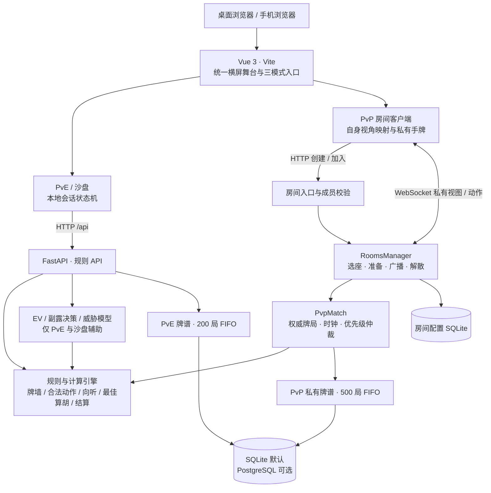

<div align="center">

# 顶龙麻将

**一桌东方雅趣，一场实时博弈。**

以现代 Web 技术复刻顶龙牌桌，让人机磨砺、真人对战与规则推演各得其所。

[](https://github.com/Karry1123/DingLongMahjong/actions/workflows/deploy.yml)
[](https://github.com/Karry1123/DingLongMahjong/releases/tag/v0.3.1-beta)


[规则与配例](rule.md) · [快速启动](#快速启动) · [架构](#系统架构) · [测试诊断](docs/audit-2026-09-28.md) · [局域网联机](docs/lan-preview.md)

</div>

---

> 当前版本 **v0.3.1-beta**，前端配置、界面版本与后端 API 版本统一。构建徽章对应真实部署工作流，测试结果另见本地诊断报告。

## 三种入口，一套正统牌桌

| 模式 | 体验 | 辅助边界 |
| --- | --- | --- |
| **人机对战 · PvE** | 与智能 AI 磨砺牌技，观察牌形与攻守转换 | 切牌／副露 EV、进张与动态局势推演 |
| **玩家对战 · PvP** | 2～4 位真人同桌，余位由 AI 补齐 | 隐藏 EV、向听、进张、个人危险度；保留公开局势提示 |
| **全景沙盘 · Sandbox** | 自由摆牌、推演残局、验证胡数 | 四家可见，使用同一规则与算胡引擎 |

## 项目亮点

### 精雕牌桌，照顾每一次摸打

墨绿桌面、温润牌面与国风金色点缀，PvE 和 PvP 直接复用同一套牌桌、手牌、副露、牌河与结算组件。1280×720 逻辑舞台按视口等比缩放，手机竖屏统一旋转适配；开局三秒财神亮相，再平滑归入中央牌槽。

开启自动理牌时，普通牌保持花色点数序，只有财神／白板替身可拖拽插牌；锚点在后续摸打和副露扣牌时保留。关闭自动理牌后全手自由排序。AI 通常思考六秒出牌、三秒响应，复杂计算超时则完成即行动。

### 实时联机，各看各的主视角

六位房间号、四方固定选座、房主标记、全员准备与 3-2-1 同步开局。无论坐东南西北，自己永远在屏幕下方，真实昵称与 AI 名称按物理座位映射。

后端权威推进发牌、合法动作与抢断仲裁。出牌 **10 秒**、副露响应 **6 秒**，每家每局另有 **30 秒 Time Bank**；高优先级胡／碰／杠未决时，下家吃牌时钟挂起。局后全员确认才进入下一局。

### 公正对局，隐私与移动体验并重

PvP 不请求 EV／威胁辅助接口，不公开对手暗手；鸣牌决策期间，旁观者只见中立公共等待提示，个人响应倒计时和时间池不会暴露对手搭子倾向。暗杠统一“三盖一明”，全场公开杠牌种类。

进入移动端对局尝试原生全屏，不支持时使用固定视口铺满；保留手动全屏按钮。支持 Screen Wake Lock 的浏览器会申请屏幕常亮，切回页面后重新申请。音效按需通过 Web Audio fetch／解码播放，摸牌与轮到本人操作时发出短促提醒。

完整 PvP 牌谱进入独立私有存储，保留 **500 局 FIFO**，可供后台排查；玩家结算界面不开放 PvP 复盘。默认 SQLite，配置 PostgreSQL 后使用云端持久库。PvE 的 200 局云端牌谱及本机 10 局缓存独立管理。

### 规则落地，胡数与账目分开核算

136 张牌、白板固定替身、真财神万能成牌、底胡 10、刻杠明暗胡数、本门自风与三元翻、硬碰硬和得还原、清／混一色、辣子与多方轧差，均由统一引擎计算。**严格没有圈风翻番**，也不附加未实现的日麻番种。

规则文档提供可复算牌型，解释 GM-4720EF 的“碰一万、切中叫听”，以及红中明刻叠加白板替身暗刻的胡数分配。推荐策略与行牌合法性分别定义，算胡与推荐共享最佳拆解逻辑。

## 系统架构



| 路径 | 职责 |
| --- | --- |
| `frontend/src/components/` | 共用牌桌、牌面、操作面板、房间与结算 UI |
| `frontend/src/composables/` | PvE 会话、自动推进、房间连接、全屏与方向适配 |
| `frontend/src/utils/` | 手牌锚定、视角映射、时钟、局势文案、音效与常亮 |
| `backend/app/api/` | HTTP 规则接口与房间 WebSocket 入口 |
| `backend/app/core/` | 规则、计分、推荐、房间调度与存储 |
| `backend/tests/`、`frontend/tests/` | 规则、契约、状态机及组件回归 |
| `frontend/scripts/` | 独立浏览器联调、布局与多窗口冒烟脚本 |
| `docs/` | 验证流程、联机说明及诊断报告 |

房间连接和权威牌局目前在进程内，运行要求是 **单 Uvicorn worker、单服务实例**。数据库持久化不等于房间可跨实例恢复；真人断线会按现行规则解散全房间。多实例部署需要后续共享状态与广播设计。

## 快速启动

建议 **Node.js 22.12+**、**Python 3.11**，以及支持现代浏览器 API 的浏览器。以下为 Windows PowerShell 命令，在项目根目录执行；两个开发服务使用不同终端。

### 1 · 后端

```powershell
cd backend
py -3.11 -m venv .venv
.\.venv\Scripts\python.exe -m pip install -r requirements.txt
.\.venv\Scripts\python.exe -m uvicorn app.main:app --host 0.0.0.0 --port 8000 --reload
```

无需激活虚拟环境。健康检查为 [localhost:8000/health](http://localhost:8000/health)，交互 API 文档为 [localhost:8000/docs](http://localhost:8000/docs)。已有 `.venv` 时跳过创建步骤。

### 2 · 前端

另开终端，从项目根目录进入前端：

```powershell
cd frontend
npm.cmd ci
npm.cmd run dev -- --host 0.0.0.0 --port 5173
```

电脑打开 [localhost:5173](http://localhost:5173/)。开发模式 API 配置留空或使用 `/`，HTTP 与 WebSocket 统一走 Vite `/api` 代理，后端地址不会指向手机自身的 localhost。`predev`／`prebuild` 自动生成按需播放的 `.dat` 语音数据，无需手工准备。

### 3 · 手机局域网／热点联机

1. 手机和电脑加入同一网络，或让电脑连接手机热点。
2. 在电脑执行 `ipconfig`，找到当前网卡的 IPv4。
3. 手机访问 `http://电脑IPv4:5173/`；Windows 防火墙允许该网络访问前端端口。
4. 两端分别选择玩家对战，输入最多六字昵称，一端创建房间，另一端用六位数字加入。
5. 入席、换座、准备，全员确认后同步开局。

代理模式只需手机可达 5173；若直连后端还需开放 8000。热点重连可能更换 IP。完整排查见[局域网预览说明](docs/lan-preview.md)。

手机横屏适配不依赖原生全屏许可；浏览器拒绝自动全屏时仍保持铺满舞台。**Screen Wake Lock 需要浏览器支持及安全上下文**，普通局域网 HTTP 通常无法申请常亮；需要该能力时使用可信 HTTPS。页面无法保证被系统强制切后台后连接不断。

### 构建与回归

前端在 `frontend` 中运行：

```powershell
node --test tests/*.test.js
npm.cmd run build
```

生产构建要求配置 `VITE_API_BASE_URL`，仓库现有生产配置用于默认部署。部署自己的后端时，设置为其 HTTPS 根地址，例如：

```powershell
$env:VITE_API_BASE_URL = 'https://your-backend.example'
npm.cmd run build
```

后端在 `backend` 中运行：

```powershell
.\.venv\Scripts\python.exe -m pip install pytest httpx
.\.venv\Scripts\python.exe -m pytest -v --tb=long
```

本次本地结果：**后端 429 项 + 17 个子测试通过，前端 104 项通过，生产构建通过**。诊断报告保留逐用例清单、非失败警告及待处理事项；这些结果不代替物理手机、微信或公网数据库验收。

多浏览器验证脚本及独立夹具说明见 [PvP 联调文档](docs/pvp-phase1.md)。构建输出在 `frontend/dist/`；当前生产路径为 `/DingLongMahjong/`，更改托管子路径时需同步核对 Vite `base`。GitHub Pages 工作流只构建并部署前端，当前没有运行全量测试的 CI 阶段。

### 存储与部署配置

| 环境变量 | 用途 |
| --- | --- |
| `VITE_API_BASE_URL` | 生产前端访问的后端根地址；开发可留空／`/` |
| `ALLOWED_ORIGINS` | 额外允许的完整来源，以逗号分隔；HTTP 与 WS 共享来源策略 |
| `ROOM_DB_PATH` | 房间配置 SQLite 路径 |
| `PVP_RECORD_DB_PATH` | PvP 500 局私有 SQLite 路径；显式配置时优先使用 SQLite |
| `GAME_RECORD_DB_PATH` | PvE 200 局 SQLite 路径；显式配置时优先使用 SQLite |
| `DATABASE_URL` | PostgreSQL 连接地址；没有对应 SQLite 覆盖配置时启用 |

默认数据库位于 `backend/data/`，不提交版本库。云服务临时文件系统不能保证 SQLite 重启后留存，长期牌谱应配置持久存储。部署入口参考 [DEPLOY.md](DEPLOY.md) 与 [render.yaml](render.yaml)，最新联机约束以本 README 和 PvP 文档为准。

## 版本演进与路线图

| 阶段 | 重点 |
| --- | --- |
| **0.1.1-beta · 历史记录** | 副露供牌绑定、牌河扣减、状态步进及早期移动布局 |
| **0.2.2-beta · 已迭代** | 顶龙品牌、牌面设计、财神仪式、推荐逻辑与微缩排版 |
| **0.2.3-beta · 历史版本** | 无圈风翻番、局势提示、自摸区分、手牌财神锚定、碰听推荐纠偏 |
| **0.2.4-beta · 开发阶段** | 分阶段接入房间、权威牌局与联机交互 |
| **v0.3.1-beta · 当前版本** | 三模式入口、PvP 联机、视角映射、双倒计时与 30 秒时间池、共用结算、500 局私有牌谱、常亮与鸣牌隐私；统一规则文档 |

当前版本与历史变更见 [CHANGELOG.md](CHANGELOG.md)。完整功能说明与实现边界见本文亮点及 [rule.md](rule.md)。

- [ ] 测试基础设施整理：隔离 Vite HMR 端口与缓存，减少并行测试噪声。
- [ ] 持续集成加入前后端全量回归及可复现多窗口冒烟。
- [ ] 真机矩阵：iOS Safari、Android Chrome、微信 WebView 的全屏与常亮验收。
- [ ] PostgreSQL 云端存储与 FIFO 的部署环境验收。
- [ ] 在保留仲裁一致性和隐私边界的前提下，设计房间共享状态与多实例调度。

## 参与开发

规则变更请同时提供具体物理牌型、财神身份、座位风、胡张归属与可复算结果，并核对合法动作、赢家算胡、未胡固有胡及推荐计算。界面变更应覆盖桌面、手机竖屏旋转及所有自身座位视角。

测试失败时先保存完整日志并定位原因，避免为迎合断言改变规则。项目当前没有独立开源许可证文件；贡献与再分发前需明确授权条款，不在这里宣称不存在的许可证。

---

<div align="center">

**摸打有章，胜负有据。**

顶龙麻将 · 从一张牌，推演一桌局。

</div>
